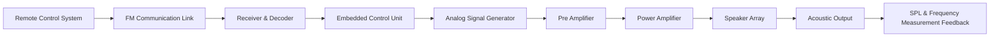

# Directional Acoustic Beamforming System


An ongoing hardware research project developing a controlled acoustic signal generation platform using analog signal processing, power amplification, transducer arrays, and embedded control.

---

## Table of Contents

- [Overview](#overview)
- [System Architecture](#system-architecture)
  - [High-Level Block Diagram](#high-level-block-diagram)
  - [Signal Flow](#signal-flow)
- [Hardware Architecture](#hardware-architecture)
  - [1. Control and Communication Module](#1-control-and-communication-module)
  - [2. Analog Signal Generation Stage](#2-analog-signal-generation-stage)
  - [3. Analog Filtering Stage](#3-analog-filtering-stage)
  - [4. Power Amplifier Stage](#4-power-amplifier-stage)
  - [5. Acoustic Transducer Array](#5-acoustic-transducer-array)
- [Repository Structure](#repository-structure)
- [Schematic Documentation](#schematic-documentation)
- [Bill of Materials](#bill-of-materials-documentation)
- [PCB Design Guidelines](#pcb-design-guidelines)
- [Simulation](#simulation)
- [Embedded Firmware](#embedded-firmware)
- [Testing and Validation](#testing-and-validation)
- [Tools Used](#tools-used)
- [Applications](#applications)
- [Future Improvements](#future-improvements)
- [References](#references)
- [Disclaimer](#disclaimer)

---

## Overview

The **Directional Acoustic Beamforming System** is an ongoing hardware research project focused on developing a controlled acoustic signal generation platform using analog signal processing, power amplification, transducer arrays, and embedded control.

The system explores the complete acoustic signal chain:

> **Control Signal → Wireless Trigger → Signal Generation → Analog Conditioning → Power Amplification → Acoustic Transducer Array → SPL Characterization**

The project emphasizes:

- Analog circuit design
- Low-noise audio signal processing
- Power amplifier design
- Acoustic beamforming principles
- Embedded system integration
- Signal integrity optimization

---

## System Architecture

### High-Level Block Diagram



### Signal Flow

| Stage | Function |
|---|---|
| Control Module | Generates system activation command |
| FM Transmitter | Sends encoded trigger signal |
| FM Receiver | Receives and validates command |
| Controller | Controls system activation |
| Signal Generator | Produces required analog waveform |
| Pre-Amplifier | Provides voltage gain and buffering |
| Power Amplifier | Drives acoustic transducers |
| Speaker Array | Produces directional acoustic output |
| Measurement System | Evaluates SPL and frequency response |

---

## Hardware Architecture

### 1. Control and Communication Module

The control subsystem manages system activation and communication.

**Components**

| Component | Purpose |
|---|---|
| Microcontroller | System logic and control |
| FM Transmitter | Wireless command transmission |
| FM Receiver | Command reception |
| Decoder Circuit | Signal validation |
| Switching Circuit | Power stage activation |

### 2. Analog Signal Generation Stage

The analog front-end generates and conditions the acoustic waveform.

**Signal Chain**

```
Waveform Generation
        |
        ↓
   Buffer Stage
        |
        ↓
    Filtering
        |
        ↓
Voltage Gain Stage
        |
        ↓
Power Amplifier
```

**Design Parameters**

| Parameter | Objective |
|---|---|
| Frequency Range | Optimized acoustic output |
| Gain Control | Adjustable amplitude |
| Noise | Minimum unwanted components |
| Distortion | Maintain waveform integrity |
| Stability | Reliable continuous operation |

### 3. Analog Filtering Stage

Filtering is implemented to control frequency characteristics.

**Filter Objectives**

| Filter Type | Purpose |
|---|---|
| Low Pass Filter | Remove high frequency noise |
| Band Pass Filter | Select operating frequency range |
| Notch Filter | Reduce interference components |

**Design considerations:**
- Component tolerance
- Phase response
- Noise contribution
- Signal attenuation

### 4. Power Amplifier Stage

The amplifier converts low-level analog signals into sufficient power to drive the transducer array.

**Amplifier Requirements**

| Parameter | Design Goal |
|---|---|
| Output Power | Drive speaker array |
| Efficiency | Reduce power loss |
| Thermal Stability | Reliable operation |
| THD | Minimize distortion |

**Possible amplifier architectures:**
- Class AB amplifier
- Class D amplifier

### 5. Acoustic Transducer Array

The acoustic output stage uses multiple transducers arranged for directional emission.

**Beamforming Parameters**

| Parameter | Importance |
|---|---|
| Array Geometry | Controls beam direction |
| Phase Alignment | Controls constructive interference |
| Frequency Response | Determines acoustic behavior |
| SPL Distribution | Evaluates output uniformity |

---

## Repository Structure

```
Directional-Acoustic-Beamforming-System/
│
├── README.md
│
├── Documentation/
│   ├── System_Architecture.md
│   ├── Design_Notes.md
│   ├── Calculations/
│   └── Research_Papers.md
│
├── Schematics/
│   ├── Control_Module/
│   │   ├── FM_Receiver.sch
│   │   └── Controller.sch
│   │
│   ├── Analog_Front_End/
│   │   ├── Signal_Generator.sch
│   │   ├── Filter_Stage.sch
│   │   └── Pre_Amplifier.sch
│   │
│   ├── Power_Amplifier/
│   │   └── Amplifier.sch
│   │
│   └── Power_Supply/
│       └── Regulation.sch
│
├── PCB/
│   ├── KiCad_Project/
│   ├── Gerber_Files/
│   ├── PCB_Render/
│   └── Assembly_Documentation/
│
├── Simulation/
│   ├── LTspice/
│   ├── MATLAB/
│   └── Python_Analysis/
│
├── Firmware/
│   ├── Embedded_Code/
│   └── Communication/
│
└── Testing/
    ├── SPL_Measurements/
    ├── Frequency_Response/
    ├── Oscilloscope_Data/
    └── Results/
```

---

## Schematic Documentation

Each schematic folder contains:

```
Module_Name/
├── Schematic_File
├── BOM.csv
├── Design_Notes.md
├── Simulation_Result.png
└── Testing_Data/
```

## Bill of Materials Documentation

Example:

| Component | Specification | Purpose |
|---|---|---|
| Op-Amp | Low Noise Op-Amp | Signal conditioning |
| MOSFET Driver | High Current Driver | Power switching |
| MOSFET | Power Stage | Amplification |
| Capacitors | Low ESR | Filtering |
| Resistors | Precision | Gain setting |
| MCU | STM32/ESP32 | Control |

---

## PCB Design Guidelines

**Layout Considerations**

| Area | Design Practice |
|---|---|
| Analog Section | Separate from digital circuits |
| Grounding | Star grounding |
| Power Lines | Short high-current paths |
| Signal Lines | Controlled routing |
| EMI | Filtering and shielding |

---

## Simulation

**LTspice** — used for:
- Amplifier verification
- Frequency response analysis
- Filter simulation
- Transient analysis

**MATLAB / Python** — used for:
- Beamforming simulation
- Signal analysis
- Frequency response plots
- SPL calculations

---

## Embedded Firmware

**Responsibilities**
- System activation control
- Communication handling
- Safety monitoring
- Operating mode selection

**Possible platforms**

| Platform | Application |
|---|---|
| STM32 | Real-time control |
| ESP32 | Wireless communication |
| Arduino | Prototype validation |

---

## Testing and Validation

**Electrical Testing**

| Test | Purpose |
|---|---|
| Oscilloscope Analysis | Verify waveform integrity |
| Gain Measurement | Validate amplifier stages |
| Current Measurement | Power analysis |
| Thermal Testing | Reliability evaluation |

**Acoustic Testing**

| Test | Purpose |
|---|---|
| SPL Measurement | Output characterization |
| Frequency Sweep | Response analysis |
| Phase Measurement | Beamforming optimization |
| Distortion Analysis | Signal quality |

---

## Tools Used

| Category | Tools |
|---|---|
| Circuit Simulation | LTspice, PSpice |
| PCB Design | KiCad |
| Embedded Development | STM32CubeIDE, Arduino IDE |
| Programming | C, Python |
| Signal Processing | MATLAB, NumPy, SciPy |
| Measurement | Oscilloscope, SPL Meter |

---

## Applications

| Domain | Application |
|---|---|
| Acoustic Research | Beamforming experiments |
| Industrial Systems | Directional audio communication |
| Robotics | Acoustic localization |
| Assistive Technology | Focused audio delivery |
| Communication Systems | Spatial audio |

---

## Future Improvements

- Adaptive beam steering
- Closed-loop acoustic control
- Digital phase synchronization
- Real-time acoustic modelling
- Automated SPL optimization

---

## References

Research areas:
- Acoustic Beamforming
- Array Signal Processing
- Active Noise Control
- Audio Power Amplifier Design
- Embedded Signal Processing

---

## Disclaimer

This project is developed for academic research, learning, and engineering development purposes.
